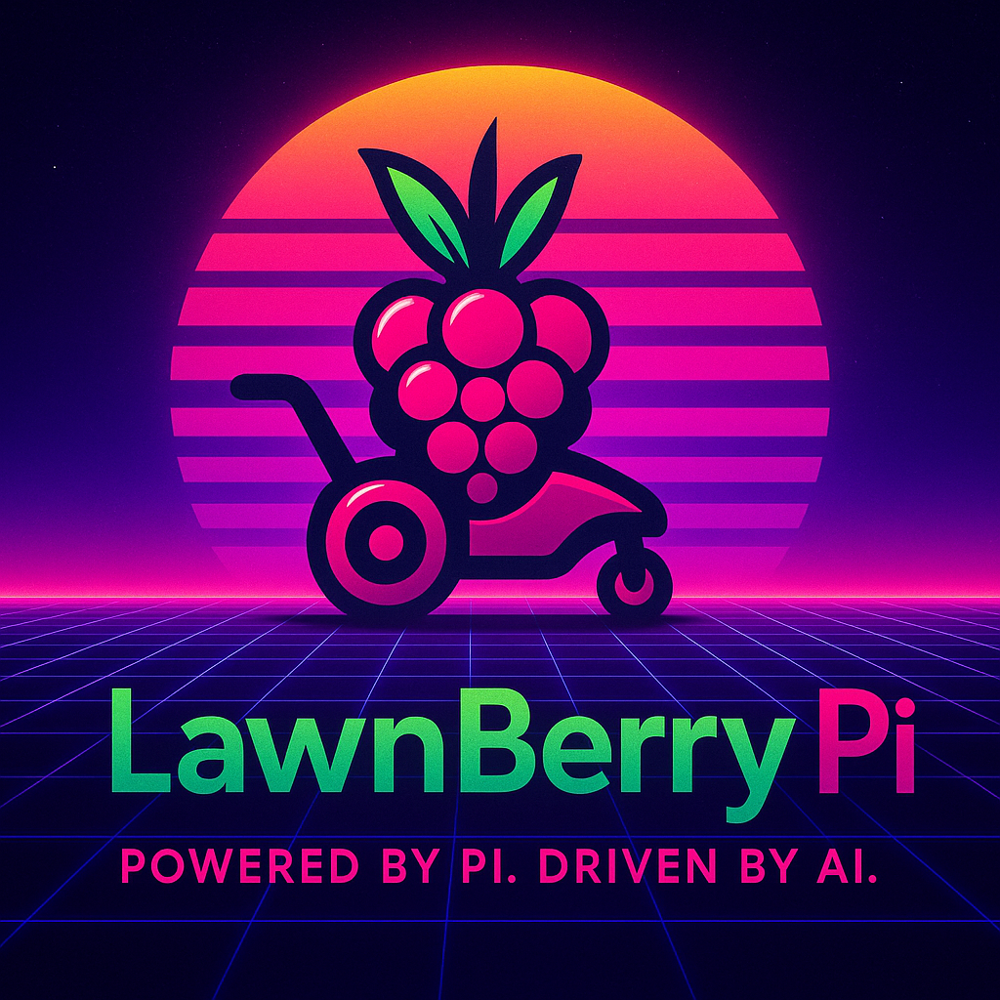

# LawnBerryPi - Autonomous Lawn Mower System



LawnBerryPi is a comprehensive autonomous lawn mower system built on Raspberry Pi. It combines advanced navigation, intelligent scheduling, and safety systems to provide autonomous lawn care for residential properties.

## 🌟 Key Features

### 🤖 Autonomous Operation
- **GPS Navigation**: RTK-GPS with centimeter accuracy for precise boundary following
- **Intelligent Mowing Patterns**: Multiple patterns optimized for different yard types
- **Obstacle Avoidance**: Advanced sensor fusion for safe navigation
- **Weather Integration**: Automatic scheduling based on weather conditions

### 🛡️ Safety First
- **Multiple Emergency Stop Methods**: Web interface, physical sensors, and manual controls
- **Comprehensive Safety Systems**: Tilt detection, blade guards, and perimeter monitoring
- **Child and Pet Safety**: Automatic detection and response protocols
- **Real-time Monitoring**: Live camera feed and sensor data

### 📱 Smart Control
- **Web-based Interface**: Responsive design accessible from any device
- **Real-time Dashboard**: Live status, camera feed, and system monitoring
- **Flexible Scheduling**: Weather-aware scheduling with multiple patterns
- **Mobile Optimization**: Progressive Web App for smartphone control

### 🔧 Professional Features
- **Modular Hardware Architecture**: Plugin-based system for easy expansion
- **Advanced Diagnostics**: Comprehensive hardware monitoring and testing
- **Fleet Management**: Multi-mower coordination and centralized control
- **AI Training Capabilities**: Custom object detection and yard learning

## 📖 Documentation

**New users start here**: [📋 Installation Guide](docs/installation-guide.md)

### 🚀 Getting Started
- **[Installation Guide](docs/installation-guide.md)** - Complete step-by-step installation
- **[First-Time Setup](docs/first-time-setup.md)** - Configure your LawnBerryPi for your yard
- **[User Manual](docs/user-manual.md)** - Comprehensive operating instructions
- **[Safety Guide](docs/safety-guide.md)** - ⚠️ **Read before operating** - Essential safety information

### 🔧 Operation & Maintenance
- **[Troubleshooting Guide](docs/troubleshooting-guide.md)** - Solve common problems
- **[Maintenance Guide](docs/maintenance-guide.md)** - Keep your system running optimally
- **[Quick Reference](docs/quick-reference/)** - Printable cards and checklists

### 📚 Complete Documentation
Visit the **[Documentation Index](docs/README.md)** for all available guides, references, and technical information.

## 🏗️ System Architecture

### Hardware Components
- **Raspberry Pi 4** (8GB RAM) - Main computing platform
- **RoboHAT with RP2040** - Motor control and sensor interface
- **RTK-GPS Module** - Centimeter-accurate positioning
- **Environmental Sensors** - Weather monitoring and safety
- **Camera System** - Object detection and monitoring
- **LiFePO4 Battery** - Reliable power with solar charging
- **Drive Motors** - 12V worm gear motors with precision control

### Software Architecture
- **Modular Python Backend** - Microservices design with asyncio
- **React Web Interface** - Responsive PWA with real-time updates
- **Real-time Communication** - Single multiplexed WebSocket (sensors, navigation, power, safety)
- **Weather Integration** - OpenWeather API with intelligent scheduling
- **Safety Systems** - Multi-layered protection and emergency response

## Installation

LawnBerry Pi features comprehensive installation automation with hardware detection and guided setup.

### 🚀 Quick Start (Recommended)

For first-time installation on a fresh Raspberry Pi:

```bash
# Clone the repository
git clone https://github.com/acredsfan/lawnberry_pi.git lawnberry
cd lawnberry

# Run the Bookworm-optimized installer
bash scripts/install_lawnberry.sh

# The installer will:
# - Detect Raspberry Pi OS Bookworm and enable optimizations
# - Install Python 3.11 specific dependencies
# - Configure systemd services with enhanced security
# - Set up hardware interfaces with improved drivers

# Optional: Run the first-time setup wizard
python3 scripts/first_run_wizard.py
```

### UART4 (IMU) Prerequisite on Pi 5

On Raspberry Pi OS Bookworm (Pi 5), enabling the IMU on UART4 requires adding an overlay to the boot configuration before running the installer end-to-end. This is a one-time change and requires a reboot to take effect.

1) Add the overlay (Bookworm path):

```bash
sudo sh -c 'grep -q "^dtoverlay=uart4$" /boot/firmware/config.txt || echo dtoverlay=uart4 >> /boot/firmware/config.txt'
sudo sh -c 'grep -q "^enable_uart=1$" /boot/firmware/config.txt || (
    grep -q "^enable_uart=" /boot/firmware/config.txt && sed -i "s/^enable_uart=.*/enable_uart=1/" /boot/firmware/config.txt || echo enable_uart=1 >> /boot/firmware/config.txt
)'
sync
```

2) Reboot to apply overlays:

```bash
sudo reboot
```

3) After reboot, verify the device (it may appear as `ttyAMA4`):

```bash
ls -l /dev/ttyAMA4 || ls -l /dev/ttyS4 || true
```

If you prefer an automated check, run `scripts/check_uart4.sh` for a quick status and guidance.

### ✨ Installation Features

- 🔍 **Automatic Hardware Detection** - Scans and configures connected sensors, GPS, camera, and controllers
- 🔑 **Environment Setup** - Secure API key configuration with validation
- 💾 **Database Initialization** - Automated SQLite and Redis setup
- 🧪 **System Testing** - Comprehensive connectivity and functionality tests
- 🧙 **First-Run Wizard** - User-friendly guided setup for beginners
 - 🛰️ **Deferred Live Data Start** - Sensor streams attach only after stable WebSocket connection
 - 🧪 **Optional Mock Mode** - Set `VITE_USE_MOCKS=true` (frontend) to preload demo status & weather while backend is offline

### 📋 Available Scripts

- `scripts/install_lawnberry.sh` - Main installation script with hardware detection
- `scripts/first_run_wizard.py` - Interactive setup wizard for new users
- `scripts/hardware_detection.py` - Standalone hardware detection and testing
- `scripts/setup_environment.py` - Environment variable and API key configuration
- `scripts/update_lawnberry.sh` - System updates with configuration preservation
- `scripts/uninstall_lawnberry.sh` - Clean system removal

### 📚 Installation Documentation

- **Installation Scripts:** [scripts/README.md](scripts/README.md) - Detailed script documentation
- **Installation Guide:** [docs/installation-guide.md](docs/installation-guide.md) - Complete setup instructions
- **Hardware Guide:** [docs/hardware-overview.md](docs/hardware-overview.md) - Hardware requirements and connections

## Quick Start

```python
import asyncio
from src.hardware import create_hardware_interface

async def main():
    # Create hardware interface
    hw = create_hardware_interface("config/hardware.yaml")
    
    try:
        # Initialize all hardware
        await hw.initialize()
        
        # Read sensor data
        sensor_data = await hw.get_all_sensor_data()
        for name, reading in sensor_data.items():
            print(f"{name}: {reading.value} {reading.unit}")
        
        # Control RoboHAT
        await hw.send_robohat_command('rc_disable')
        await hw.send_robohat_command('pwm', 1500, 1500)
        
        # Control GPIO
        await hw.control_gpio_pin('blade_enable', 1)
        
        # Get camera frame
        frame = await hw.get_camera_frame()
        
    finally:
        await hw.shutdown()

asyncio.run(main())
```

## Configuration

Edit `config/hardware.yaml` to customize hardware settings:

```yaml
# I2C Configuration
i2c:
  bus_number: 1
  devices:
    tof_left: 0x29
    tof_right: 0x30
    power_monitor: 0x40

# Plugin Configuration
plugins:
  - name: "tof_left"
    enabled: true
    parameters:
      i2c_address: 0x29
      shutdown_pin: 22
      interrupt_pin: 6
```

## RoboHAT Interface

The system implements the complete RoboHAT command protocol:

```python
# Take control from RC
await hw.send_robohat_command('rc_disable')

# Send motor commands (1000-2000 μs)
await hw.send_robohat_command('pwm', 1500, 1600)  # steer, throttle

# Reset encoder
await hw.send_robohat_command('enc_zero')

# Return control to RC
await hw.send_robohat_command('rc_enable')
```

## Plugin Development

Create custom sensor plugins by extending `HardwarePlugin`:

```python
from src.hardware.plugin_system import HardwarePlugin

class CustomSensorPlugin(HardwarePlugin):
    @property
    def plugin_type(self) -> str:
        return "custom_sensor"
    
    @property
    def required_managers(self) -> list:
        return ["i2c"]
    
    async def initialize(self) -> bool:
        # Initialize your sensor
        return True
    
    async def read_data(self):
        # Read and return sensor data
        pass
```

## Testing

Run the comprehensive test suite:

```bash
# Run all tests
python -m pytest tests/ -v

# Run specific test categories
python -m pytest tests/test_hardware_interface.py::TestI2CManager -v

# Run with coverage
python -m pytest tests/ --cov=src/hardware --cov-report=html
```

## API Reference

### HardwareInterface

Main interface for all hardware operations:

- `initialize()` - Initialize all hardware components
- `get_sensor_data(name)` - Read data from specific sensor
- `get_all_sensor_data()` - Read data from all sensors
- `send_robohat_command(cmd, *args)` - Send command to RoboHAT
- `control_gpio_pin(name, value)` - Control GPIO pin by name
- `get_camera_frame()` - Get latest camera frame
- `get_system_health()` - Get overall system health status
- `add_sensor(name, type, params)` - Dynamically add sensor
- `remove_sensor(name)` - Dynamically remove sensor

### Data Structures

Standard sensor reading format:

```python
@dataclass
class SensorReading:
    timestamp: datetime
    sensor_id: str
    value: Any
    unit: str
    quality: float  # 0.0-1.0
    metadata: Dict[str, Any]
```

### Health Monitoring

Track device health and connection status:

```python
health = await hw.get_system_health()
print(f"System healthy: {health['overall_healthy']}")
print(f"Plugin health: {health['plugins']}")
print(f"Device health: {health['devices']}")
```

## Safety Features
## API Meta & Health

The backend exposes lightweight operational endpoints:

* `GET /health` – Liveness probe (no auth)
* `GET /api/v1/meta` – Service metadata (version, uptime, MQTT connectivity) (no auth)
* `GET /api/v1/maps/*` (selected read-only map endpoints) – Public read access for embedding map UI

Systemd post-start probe (ensures readiness): already embedded in `src/web_api/lawnberry-api.service` as `ExecStartPost` calling `scripts/health_check_web_api.sh`.

These are safe for status pages and deployment health checks. A systemd ExecStartPost health probe can validate readiness (see scripts/health_check_web_api.sh).

### SPA Routing
The web UI is mounted under `/ui`. Direct navigation to deep links like `/ui/maps` or `/ui/navigation` is supported via an internal single-page fallback. Convenience redirects map top-level paths (e.g. `/maps`) to their `/ui/*` equivalents.

### Automatic UI Rebuild
The API systemd unit performs a conditional Web UI rebuild before start via `ExecStartPre` calling `scripts/auto_rebuild_web_ui.sh`:
* Fast no-op if no source changes (mtime comparison of `web-ui/src`, `public`, `package.json`, `vite.config.*`).
* Triggers `npm run build` only when needed; enforces timeout (default 600s via `MAX_BUILD_SECONDS`).
* Fails startup if a required rebuild fails, preventing stale or partial assets.


### Automatic Failsafe
- Communication timeouts trigger RC mode fallback
- Hardware watchdog integration prevents system lockup
- Emergency stop capability through software controls

### Error Recovery
- Exponential backoff with jitter for communication retries
- Automatic sensor reconnection on failure
- Plugin hot-swapping for recovery without restart

### Resource Management
- Exclusive device access prevents bus conflicts
- Proper cleanup on shutdown prevents resource leaks
- Memory-efficient frame buffering for camera

## Performance

- **Sensor Reading**: <50ms typical latency
- **I2C Operations**: Concurrent access with proper locking
- **Camera Capture**: 30fps with 5-frame buffer
- **Memory Usage**: Efficient caching with automatic cleanup

### Web UI Theming Note: LinearProgress Colors
MUI's `LinearProgress` component only exposes `primary` and `secondary` via its `color` prop by default. Passing values such as `success`, `warning`, or `error` (or dot notation like `error.main`) previously caused a runtime error (`Cannot read properties of undefined (reading 'main')`).

To display semantic status colours we now style progress bars exclusively through the `sx` prop targeting `& .MuiLinearProgress-bar` and computing a palette colour dynamically. Example pattern:

```tsx
<LinearProgress
    variant="determinate"
    value={value}
    sx={{
        backgroundColor: (theme) => theme.palette.grey[800],
        '& .MuiLinearProgress-bar': {
            backgroundColor: (theme) => selectColor(theme, value),
            boxShadow: (theme) => `0 0 10px ${selectColor(theme, value)}`
        }
    }}
/>
```

This approach is used in `Dashboard` (battery & coverage) and `RCControl` (channel strength). Future additions should follow this pattern unless explicit module augmentation is added to extend supported `color` variants.

### Live Data Flow (Frontend 2025 Update)

```
WebSocket ⇨ websocket service (auto reconnect & topic subscription)
         ⇨ sensorDataService (lazy start post-connect)
         ⇨ Redux mowerSlice (setStatus / updateStatus)
         ⇨ UI components (Dashboard, Maps, Power, RCControl)
```

Safeguards:
- 15s stale-data watchdog surfaces reconnect banner.
- Mock gating via `VITE_USE_MOCKS` prevents mixing synthetic & live packets.
- Navigation position & coverage updates come through lightweight incremental `updateStatus` actions to reduce render cost on Pi.

## Contributing

1. Fork the repository
2. Create a feature branch
3. Add comprehensive tests
4. Follow the existing code style
5. Submit a pull request

## License

MIT License - see LICENSE file for details.
