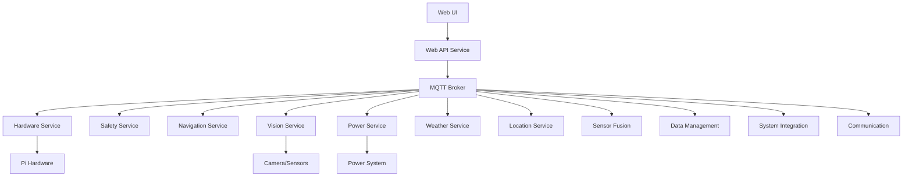

# LawnBerryPi Developer Guide

**Version:** 1.0  
**Target Audience:** Software developers extending or customizing the system  
**Last Updated:** December 2024

## Table of Contents

1. [Development Environment Setup](#development-environment-setup)
2. [System Architecture](#system-architecture)
3. [Microservices Overview](#microservices-overview)
4. [API Development](#api-development)
5. [Web UI Development](#web-ui-development)
6. [Hardware Integration](#hardware-integration)
7. [Testing Framework](#testing-framework)
8. [Plugin Development](#plugin-development)
9. [Shell Scripting Best Practices](#shell-scripting-best-practices)
10. [Deployment and CI/CD](#deployment-and-cicd)
11. [Contributing Guidelines](#contributing-guidelines)

---

## Development Environment Setup

### Prerequisites

**Hardware Requirements:**
- Raspberry Pi 4B 16GB RAM (production) or x86_64 development machine
- Development machine with 8GB+ RAM
- Git-enabled development environment

**Software Requirements:**
- Python 3.11+ 
- Node.js 18+ and npm
- Docker and Docker Compose
- Git version control
- VS Code or PyCharm (recommended IDEs)

### Local Development Setup

1. **Clone Repository:**
```bash
git clone https://github.com/your-org/lawnberry-pi.git
cd lawnberry-pi
```

2. **Python Environment:**
```bash
python -m venv venv
source venv/bin/activate  # On Windows: venv\Scripts\activate
pip install -r requirements.txt
pip install -r requirements-dev.txt
```

3. **Node.js Environment:**
```bash
cd web-ui
npm install
npm run dev
```

4. **Environment Configuration:**
```bash
cp .env.example .env
# Edit .env with your development API keys and settings
```

5. **Development Services:**
```bash
# Start Redis and MQTT for development
docker-compose -f docker-compose.dev.yml up -d redis mosquitto
```

### IDE Configuration

**VS Code Extensions:**
- Python extension pack
- TypeScript and React extensions
- Docker extension
- GitLens
- Pylint and Black formatting

**PyCharm Configuration:**
- Configure Python interpreter to virtual environment
- Enable automatic import sorting
- Set up code style to match project standards
- Configure debugging for microservices

---

## System Architecture

### Microservices Architecture

The LawnBerryPi system uses a distributed microservices architecture for scalability, maintainability, and fault isolation.



### Design Principles

**Single Responsibility:** Each service handles one specific domain
**Loose Coupling:** Services communicate only via MQTT messages
**High Cohesion:** Related functionality grouped within services
**Fault Isolation:** Service failures don't cascade to other services
**Scalability:** Services can be replicated or distributed as needed

### Communication Patterns

**MQTT Message Broker:**
- Asynchronous communication between services
- Topic-based routing for efficient message delivery
- QoS levels for reliable delivery when needed
- Retained messages for state persistence

**WebSocket for UI:**
- Real-time updates to web interface
- Bidirectional communication for interactive controls
- Efficient data streaming for sensor updates

**REST API:**
- Synchronous client-server communication
- Standard HTTP methods and status codes
- JSON data format for all exchanges

---

## Microservices Overview

### Core Services

#### Hardware Interface Service
**Location:** `src/hardware/`  
**Purpose:** Direct hardware communication and sensor management

**Key Components:**
- Sensor drivers (ToF, IMU, GPS, Camera)
- GPIO control and management
- I2C/UART communication protocols
- Hardware abstraction layer

**Development Notes:**
```python
# Example hardware service extension
from src.hardware.base_sensor import BaseSensor

class CustomSensor(BaseSensor):
    def __init__(self, config):
        super().__init__(config)
        self.setup_sensor()
    
    async def read_data(self):
        # Implement sensor reading logic
        return {"value": self.get_sensor_value()}
```

#### Safety Service  
**Location:** `src/safety/`  
**Purpose:** Comprehensive safety monitoring and emergency response

**Key Features:**
- Multi-sensor safety fusion
- Emergency stop mechanisms
- Hazard detection and response
- Safety rule engine

**Extension Points:**
```python
# Custom safety rule example
from src.safety.rules import SafetyRule

class CustomSafetyRule(SafetyRule):
    def evaluate(self, sensor_data):
        # Implement custom safety logic
        if self.detect_custom_hazard(sensor_data):
            return self.create_safety_alert("CUSTOM_HAZARD")
        return None
```

#### Navigation Service
**Location:** `src/navigation/`  
**Purpose:** Path planning, execution, and mowing pattern implementation

**Core Algorithms:**
- A* pathfinding for obstacle avoidance
- Pattern generation algorithms
- Coverage optimization
- Real-time path adjustment

#### Vision Service
**Location:** `src/vision/`  
**Purpose:** Computer vision processing and obstacle detection

**Features:**
- OpenCV-based image processing
- Object detection and classification
- Obstacle identification
- Visual navigation assistance

### Supporting Services

#### Power Management Service
**Location:** `src/power_management/`  
**Purpose:** Battery and solar power monitoring and optimization

#### Weather Service  
**Location:** `src/weather/`  
**Purpose:** Weather data integration and mowing schedule adaptation

#### Communication Service
**Location:** `src/communication/`  
**Purpose:** MQTT message handling and routing

#### Data Management Service
**Location:** `src/data_management/`  
**Purpose:** Data caching, persistence, and analytics

---

## API Development

### REST API Structure

**FastAPI Framework:**
- Automatic OpenAPI documentation
- Type hints for request/response validation
- Async/await support for high performance
- Dependency injection for clean architecture

### Creating New Endpoints

1. **Define Models:**
```python
# src/web_api/models.py
from pydantic import BaseModel
from typing import List, Optional

class CustomData(BaseModel):
    id: Optional[str] = None
    name: str
    value: float
    timestamp: datetime
```

2. **Create Router:**
```python
# src/web_api/routers/custom.py
from fastapi import APIRouter, Depends
from ..models import CustomData
from ..auth import get_current_user

router = APIRouter()

@router.post("/custom", response_model=CustomData)
async def create_custom(
    data: CustomData,
    current_user = Depends(get_current_user)
):
    # Implementation logic
    return data
```

3. **Register Router:**
```python
# src/web_api/main.py
from .routers import custom

app.include_router(custom.router, prefix="/api/v1", tags=["custom"])
```

### WebSocket Development

**Real-time Data Streaming:**
```python
from fastapi import WebSocket
from typing import List

class ConnectionManager:
    def __init__(self):
        self.active_connections: List[WebSocket] = []
    
    async def connect(self, websocket: WebSocket):
        await websocket.accept()
        self.active_connections.append(websocket)
    
    async def broadcast(self, message: dict):
        for connection in self.active_connections:
            await connection.send_json(message)

@app.websocket("/ws")
async def websocket_endpoint(websocket: WebSocket):
    await manager.connect(websocket)
    try:
        while True:
            # Handle incoming messages
            data = await websocket.receive_json()
            await process_websocket_message(data)
    except WebSocketDisconnect:
        manager.disconnect(websocket)
```

### Authentication and Authorization

**Token-Based Authentication:**
```python
from fastapi import Depends, HTTPException, status
from fastapi.security import HTTPBearer
import jwt

security = HTTPBearer()

async def get_current_user(token: str = Depends(security)):
    try:
        payload = jwt.decode(token.credentials, SECRET_KEY, algorithms=["HS256"])
        username = payload.get("sub")
        if username is None:
            raise HTTPException(status_code=401, detail="Invalid token")
        return {"username": username}
    except jwt.PyJWTError:
        raise HTTPException(status_code=401, detail="Invalid token")
```

---

## Web UI Development

### React TypeScript Architecture

**Technology Stack:**
- React 18 with TypeScript
- Redux Toolkit for state management
- Material-UI for component library
- Vite for build tooling
- WebSocket for real-time updates

### Component Structure

```typescript
// Component example
import React from 'react';
import { useSelector, useDispatch } from 'react-redux';
import { RootState } from '../store';

interface CustomComponentProps {
  data: CustomData;
  onUpdate: (data: CustomData) => void;
}

export const CustomComponent: React.FC<CustomComponentProps> = ({
  data,
  onUpdate
}) => {
  const dispatch = useDispatch();
  const state = useSelector((state: RootState) => state.custom);
  
  return (
    <div>
      {/* Component implementation */}
    </div>
  );
};
```

### State Management

**Redux Toolkit Slices:**
```typescript
// store/slices/customSlice.ts
import { createSlice, PayloadAction } from '@reduxjs/toolkit';

interface CustomState {
  data: CustomData[];
  loading: boolean;
  error: string | null;
}

const initialState: CustomState = {
  data: [],
  loading: false,
  error: null
};

export const customSlice = createSlice({
  name: 'custom',
  initialState,
  reducers: {
    setData: (state, action: PayloadAction<CustomData[]>) => {
      state.data = action.payload;
    },
    setLoading: (state, action: PayloadAction<boolean>) => {
      state.loading = action.payload;
    }
  }
});
```

### Google Maps Integration

**Custom Map Components:**
```typescript
// components/MapContainer/CustomMapComponent.tsx
import React, { useRef, useEffect } from 'react';

interface CustomMapProps {
  center: { lat: number; lng: number };
  zoom: number;
  onMapReady: (map: google.maps.Map) => void;
}

export const CustomMapComponent: React.FC<CustomMapProps> = ({
  center,
  zoom,
  onMapReady
}) => {
  const mapRef = useRef<HTMLDivElement>(null);
  
  useEffect(() => {
    if (mapRef.current) {
      const map = new google.maps.Map(mapRef.current, {
        center,
        zoom,
        // Custom styling and options
      });
      onMapReady(map);
    }
  }, [center, zoom, onMapReady]);
  
  return <div ref={mapRef} style={{ width: '100%', height: '400px' }} />;
};
```

### Service Integration

**API Service Layer:**
```typescript
// services/apiService.ts
class ApiService {
  private baseUrl = '/api/v1';
  
  async get<T>(endpoint: string): Promise<T> {
    const response = await fetch(`${this.baseUrl}${endpoint}`);
    if (!response.ok) {
      throw new Error(`API Error: ${response.status}`);
    }
    return response.json();
  }
  
  async post<T>(endpoint: string, data: any): Promise<T> {
    const response = await fetch(`${this.baseUrl}${endpoint}`, {
      method: 'POST',
      headers: {
        'Content-Type': 'application/json',
      },
      body: JSON.stringify(data)
    });
    return response.json();
  }
}

export const apiService = new ApiService();
```

---

## Hardware Integration

### Sensor Development

**Base Sensor Interface:**
```python
from abc import ABC, abstractmethod
from typing import Dict, Any
import asyncio

class BaseSensor(ABC):
    def __init__(self, config: Dict[str, Any]):
        self.config = config
        self.is_initialized = False
    
    @abstractmethod
    async def initialize(self) -> bool:
        """Initialize sensor hardware"""
        pass
    
    @abstractmethod
    async def read_data(self) -> Dict[str, Any]:
        """Read sensor data"""
        pass
    
    @abstractmethod
    async def cleanup(self):
        """Cleanup sensor resources"""
        pass
```

**Custom Sensor Implementation:**
```python
class CustomTemperatureSensor(BaseSensor):
    def __init__(self, config):
        super().__init__(config)
        self.i2c_address = config.get('i2c_address', 0x48)
    
    async def initialize(self) -> bool:
        try:
            # Initialize I2C communication
            import smbus
            self.bus = smbus.SMBus(1)
            # Sensor-specific initialization
            self.is_initialized = True
            return True
        except Exception as e:
            print(f"Sensor initialization failed: {e}")
            return False
    
    async def read_data(self) -> Dict[str, Any]:
        if not self.is_initialized:
            raise RuntimeError("Sensor not initialized")
        
        # Read raw data from sensor
        raw_data = self.bus.read_word_data(self.i2c_address, 0x00)
        
        # Convert to temperature
        temperature = self.convert_raw_to_celsius(raw_data)
        
        return {
            "temperature": temperature,
            "timestamp": datetime.utcnow().isoformat(),
            "sensor_id": "custom_temp_001"
        }
```

### Motor Control

**Motor Driver Interface:**
```python
class MotorController:
    def __init__(self, config):
        self.left_motor_pins = config['left_motor']
        self.right_motor_pins = config['right_motor']
        self.setup_gpio()
    
    def setup_gpio(self):
        import RPi.GPIO as GPIO
        GPIO.setmode(GPIO.BCM)
        # Configure motor control pins
        for pin in [*self.left_motor_pins, *self.right_motor_pins]:
            GPIO.setup(pin, GPIO.OUT)
    
    def set_motor_speed(self, left_speed: float, right_speed: float):
        """Set motor speeds (-1.0 to 1.0)"""
        self._set_left_motor(left_speed)
        self._set_right_motor(right_speed)
    
    def emergency_stop(self):
        """Immediately stop all motors"""
        self.set_motor_speed(0, 0)
```

### Coral TPU Development

**Optional Import Pattern for Coral TPU:**
```python
# Recommended pattern for Coral TPU integration
try:
    from pycoral.utils import edgetpu
    from pycoral.utils import dataset
    from pycoral.adapters import common
    from pycoral.adapters import detect
    import tflite_runtime.interpreter as tflite
    CORAL_AVAILABLE = True
    
    # Check for actual hardware presence
    CORAL_HARDWARE_PRESENT = len(edgetpu.list_edge_tpus()) > 0
except ImportError:
    CORAL_AVAILABLE = False
    CORAL_HARDWARE_PRESENT = False
    
    # CPU fallback using standard tflite-runtime
    try:
        import tflite_runtime.interpreter as tflite
        CPU_FALLBACK_AVAILABLE = True
    except ImportError:
        CPU_FALLBACK_AVAILABLE = False
        # Last resort: use TensorFlow Lite from full TensorFlow
        try:
            import tensorflow as tf
            tflite = tf.lite
            CPU_FALLBACK_AVAILABLE = True
        except ImportError:
            CPU_FALLBACK_AVAILABLE = False
```

**Coral TPU Manager Implementation:**
```python
class CoralTPUManager:
    def __init__(self, config):
        self.config = config
        self.interpreter = None
        self.coral_available = CORAL_AVAILABLE
        self.hardware_present = CORAL_HARDWARE_PRESENT
        self.logger = logging.getLogger(__name__)
    
    async def initialize(self, model_path: str) -> bool:
        """Initialize TPU with graceful CPU fallback"""
        try:
            if self.coral_available and self.hardware_present:
                # Try Coral TPU initialization
                self.interpreter = tflite.Interpreter(
                    model_path=model_path,
                    experimental_delegates=[edgetpu.make_edge_tpu_delegate()]
                )
                self.logger.info("Coral TPU initialized successfully")
                return True
            else:
                # CPU fallback
                self.interpreter = tflite.Interpreter(model_path=model_path)
                self.logger.info("Using CPU inference (Coral not available)")
                return True
                
        except Exception as e:
            self.logger.warning(f"Coral initialization failed: {e}, falling back to CPU")
            # Fallback to CPU-only inference
            try:
                self.interpreter = tflite.Interpreter(model_path=model_path)
                return True
            except Exception as cpu_error:
                self.logger.error(f"CPU fallback also failed: {cpu_error}")
                return False
    
    def get_inference_stats(self) -> Dict[str, Any]:
        """Get performance statistics"""
        return {
            "coral_available": self.coral_available,
            "hardware_present": self.hardware_present,
            "using_coral": self.coral_available and self.hardware_present,
            "inference_device": "coral_tpu" if (self.coral_available and self.hardware_present) else "cpu"
        }
```

**Best Practices for Coral Integration:**

1. **Always provide CPU fallback**: Never require Coral hardware
2. **Graceful degradation**: Application should work without Coral, just slower  
3. **Hardware detection**: Check for actual hardware, not just package availability
4. **Performance logging**: Track inference times for both Coral and CPU modes
5. **User feedback**: Clearly indicate which inference method is being used

**Testing Coral Features:**
```python
import pytest

class TestCoralIntegration:
    def test_graceful_fallback(self):
        """Test that system works without Coral hardware"""
        # Mock no hardware present
        with patch('pycoral.utils.edgetpu.list_edge_tpus', return_value=[]):
            manager = CoralTPUManager(config={})
            assert manager.initialize("model.tflite")
            stats = manager.get_inference_stats()
            assert stats["inference_device"] == "cpu"
    
    @pytest.mark.skipif(not CORAL_HARDWARE_PRESENT, reason="No Coral TPU hardware")
    def test_coral_hardware_detection(self):
        """Test Coral hardware detection (only runs with hardware)"""
        manager = CoralTPUManager(config={})
        assert manager.hardware_present
        assert manager.initialize("model.tflite")
        stats = manager.get_inference_stats()
        assert stats["inference_device"] == "coral_tpu"
```

**Configuration Examples:**
```yaml
# config/ml_inference.yaml
coral_tpu:
  enabled: true                    # Set to false to force CPU mode
  model_path: "/opt/lawnberry/models/detection_model_edgetpu.tflite"
  cpu_fallback_model: "/opt/lawnberry/models/detection_model.tflite"
  performance_mode: "standard"     # or "maximum"
  
cpu_fallback:
  model_path: "/opt/lawnberry/models/detection_model.tflite"
  num_threads: 2                   # CPU threads for inference
```

---

## Testing Framework

### Test Structure

**Pytest Configuration:**
```python
# conftest.py
import pytest
import asyncio
from unittest.mock import Mock

@pytest.fixture
def mock_hardware():
    """Mock hardware interfaces for testing"""
    return Mock()

@pytest.fixture
def event_loop():
    """Create event loop for async tests"""
    loop = asyncio.new_event_loop()
    yield loop
    loop.close()
```

### Unit Testing

**Service Testing:**
```python
# tests/unit/test_sensor_service.py
import pytest
from src.hardware.sensors import CustomTemperatureSensor

@pytest.mark.asyncio
async def test_sensor_initialization():
    config = {"i2c_address": 0x48}
    sensor = CustomTemperatureSensor(config)
    
    result = await sensor.initialize()
    assert result is True
    assert sensor.is_initialized is True

@pytest.mark.asyncio
async def test_sensor_data_reading():
    sensor = CustomTemperatureSensor({})
    await sensor.initialize()
    
    data = await sensor.read_data()
    assert "temperature" in data
    assert "timestamp" in data
    assert isinstance(data["temperature"], (int, float))
```

### Integration Testing

**API Testing:**
```python
# tests/integration/test_api.py
from fastapi.testclient import TestClient
from src.web_api.main import app

client = TestClient(app)

def test_get_sensor_data():
    response = client.get("/api/v1/sensors")
    assert response.status_code == 200
    data = response.json()
    assert "sensors" in data

def test_create_boundary():
    boundary_data = {
        "name": "Test Boundary",
        "points": [
            {"latitude": 40.7128, "longitude": -74.0060},
            {"latitude": 40.7130, "longitude": -74.0058}
        ]
    }
    response = client.post("/api/v1/maps/boundaries", json=boundary_data)
    assert response.status_code == 201
```

### Hardware Testing

**Mock Hardware for Testing:**
```python
# tests/hardware/test_hardware_mock.py
class MockI2CDevice:
    def __init__(self, address):
        self.address = address
        self.registers = {}
    
    def read_word_data(self, register):
        return self.registers.get(register, 0)
    
    def write_word_data(self, register, value):
        self.registers[register] = value

@pytest.fixture
def mock_i2c_bus(monkeypatch):
    devices = {}
    
    def mock_smbus(bus_number):
        return type('MockSMBus', (), {
            'read_word_data': lambda addr, reg: devices.get(addr, MockI2CDevice(addr)).read_word_data(reg),
            'write_word_data': lambda addr, reg, val: devices.get(addr, MockI2CDevice(addr)).write_word_data(reg, val)
        })()
    
    monkeypatch.setattr('smbus.SMBus', mock_smbus)
    return devices
```

---

## Plugin Development

### Plugin Architecture

The LawnBerryPi system supports plugins for extending functionality without modifying core code.

**Plugin Base Class:**
```python
# src/plugins/base_plugin.py
from abc import ABC, abstractmethod
from typing import Dict, Any

class BasePlugin(ABC):
    def __init__(self, config: Dict[str, Any]):
        self.config = config
        self.name = self.get_plugin_name()
        self.version = self.get_version()
    
    @abstractmethod
    def get_plugin_name(self) -> str:
        """Return plugin name"""
        pass
    
    @abstractmethod
    def get_version(self) -> str:
        """Return plugin version"""
        pass
    
    @abstractmethod
    async def initialize(self) -> bool:
        """Initialize plugin"""
        pass
    
    @abstractmethod
    async def cleanup(self):
        """Cleanup plugin resources"""
        pass
```

### Custom Plugin Example

```python
# plugins/weather_extension/weather_plugin.py
from src.plugins.base_plugin import BasePlugin
import aiohttp

class WeatherExtensionPlugin(BasePlugin):
    def get_plugin_name(self) -> str:
        return "weather_extension"
    
    def get_version(self) -> str:
        return "1.0.0"
    
    async def initialize(self) -> bool:
        self.api_key = self.config.get('api_key')
        self.base_url = self.config.get('base_url', 'https://api.weather.com')
        return True
    
    async def get_extended_forecast(self, location: str) -> Dict[str, Any]:
        """Get 10-day extended forecast"""
        async with aiohttp.ClientSession() as session:
            url = f"{self.base_url}/forecast/extended"
            params = {
                'location': location,
                'api_key': self.api_key
            }
            async with session.get(url, params=params) as response:
                return await response.json()
    
    async def cleanup(self):
        # Cleanup resources
        pass
```

### Plugin Registration

```python
# src/plugins/plugin_manager.py
import importlib
from typing import Dict, List
from .base_plugin import BasePlugin

class PluginManager:
    def __init__(self):
        self.plugins: Dict[str, BasePlugin] = {}
    
    async def load_plugin(self, plugin_path: str, config: Dict[str, Any]):
        """Load and initialize a plugin"""
        try:
            module = importlib.import_module(plugin_path)
            plugin_class = getattr(module, 'Plugin')
            plugin = plugin_class(config)
            
            if await plugin.initialize():
                self.plugins[plugin.name] = plugin
                return True
        except Exception as e:
            print(f"Failed to load plugin {plugin_path}: {e}")
        return False
    
    def get_plugin(self, name: str) -> BasePlugin:
        return self.plugins.get(name)
```

---

## Shell Scripting Best Practices

### Critical Syntax Rules

**⚠️ IMPORTANT: Common Syntax Errors to Avoid**

The most frequent bash scripting errors in this project involve incorrect statement closures:

#### 1. If Statement Closures
```bash
# ❌ WRONG - Never use curly braces to close if statements
if [[ condition ]]; then
    # do something
}  # This will cause syntax error!

# ✅ CORRECT - Always use 'fi' to close if statements
if [[ condition ]]; then
    # do something
fi  # Correct closure
```

#### 2. Nested If Statements
```bash
# ❌ WRONG - Mixed closures
if [[ $RAM_GB -ge 8 ]]; then
    echo "Good RAM"
    if [[ $RAM_GB -ge 16 ]]; then
        echo "Excellent RAM"
    }  # Wrong! Should be 'fi'
else
    echo "Low RAM"
fi

# ✅ CORRECT - All if statements closed with 'fi'
if [[ $RAM_GB -ge 8 ]]; then
    echo "Good RAM"
    if [[ $RAM_GB -ge 16 ]]; then
        echo "Excellent RAM"
    fi  # Correct inner closure
else
    echo "Low RAM"
fi  # Correct outer closure
```

### Bash Statement Closures Reference

| Statement Type | Opening | Closing | Example |
|---------------|---------|---------|---------|
| If statement | `if` | `fi` | `if [[ condition ]]; then ... fi` |
| Function | `function_name() {` | `}` | `my_function() { ... }` |
| While loop | `while` | `done` | `while [[ condition ]]; do ... done` |
| For loop | `for` | `done` | `for item in list; do ... done` |
| Case statement | `case` | `esac` | `case $var in pattern) ... esac` |

### Pre-Commit Syntax Checking

**Always validate your bash scripts before committing:**

```bash
# Check syntax of install script
bash -n scripts/install_lawnberry.sh

# Check all shell scripts in project
find . -name "*.sh" -type f -exec bash -n {} \; -print

# Use shellcheck if available (recommended)
shellcheck scripts/*.sh
```

### Error Prevention Strategies

#### 1. Use Consistent Indentation
```bash
# ✅ GOOD - Clear visual structure
if [[ condition ]]; then
    if [[ nested_condition ]]; then
        echo "nested action"
    fi
    echo "main action"
fi
```

#### 2. Match Opening/Closing Statements
```bash
# ✅ Use editor features to highlight matching pairs
# - Most editors will highlight matching if/fi pairs
# - Use proper indentation to visually verify structure
```

#### 3. Common Patterns in LawnBerry Scripts
```bash
# Pattern 1: Error handling with proper closures
if [[ -f "requirements.txt" ]]; then
    if pip install -r requirements.txt; then
        log_success "Installation successful"
    else
        log_error "Installation failed"
        exit 1
    fi
else
    log_error "requirements.txt not found"
    exit 1
fi  # Note: always 'fi', never '}'

# Pattern 2: Hardware detection with nested conditions
if [[ $TOTAL_RAM_GB -ge 8 ]]; then
    log_success "RAM: ${TOTAL_RAM_GB}GB detected - enabling optimizations"
    if [[ $TOTAL_RAM_GB -ge 16 ]]; then
        log_info "16GB+ RAM detected - enabling advanced features"
    fi  # Inner if closure
else
    log_warning "RAM: ${TOTAL_RAM_GB}GB - limited optimizations"
fi  # Outer if closure
```

### Quick Reference Checklist

Before committing any bash script changes:

- [ ] Run `bash -n scriptname.sh` to check syntax
- [ ] Verify all `if` statements end with `fi` (never `}`)
- [ ] Check that functions use `{}` for closures
- [ ] Ensure proper indentation for readability
- [ ] Test the script in a safe environment

### IDE Configuration

**VS Code Settings for Bash:**
```json
{
    "shellcheck.enable": true,
    "shellformat.useEditorConfig": true,
    "files.associations": {
        "*.sh": "shellscript"
    }
}
```

---

## Deployment and CI/CD

### Docker Configuration

**Dockerfile for Development:**
```dockerfile
FROM python:3.11-slim

WORKDIR /app

# Install system dependencies
RUN apt-get update && apt-get install -y \
    build-essential \
    libgpiod-dev \
    && rm -rf /var/lib/apt/lists/*

# Install Python dependencies
COPY requirements.txt .
RUN pip install -r requirements.txt

# Copy application code
COPY src/ ./src/
COPY config/ ./config/

# Set environment variables
ENV PYTHONPATH=/app
ENV LAWNBERRY_ENV=development

CMD ["python", "-m", "src.system_integration.main"]
```

**Docker Compose for Development:**
```yaml
# docker-compose.dev.yml
version: '3.8'

services:
  redis:
    image: redis:7-alpine
    ports:
      - "6379:6379"
  
  mosquitto:
    image: eclipse-mosquitto:2
    ports:
      - "1883:1883"
      - "9001:9001"
    volumes:
      - ./config/mosquitto.conf:/mosquitto/config/mosquitto.conf
  
  lawnberry-api:
    build:
      context: .
      dockerfile: Dockerfile.dev
    ports:
      - "8000:8000"
    environment:
      - REDIS_URL=redis://redis:6379
      - MQTT_BROKER=mosquitto
    depends_on:
      - redis
      - mosquitto
    volumes:
      - ./src:/app/src
      - ./config:/app/config
```

### GitHub Actions CI/CD

```yaml
# .github/workflows/ci.yml
name: CI/CD Pipeline

on:
  push:
    branches: [ main, develop ]
  pull_request:
    branches: [ main ]

jobs:
  test:
    runs-on: ubuntu-latest
    
    steps:
    - uses: actions/checkout@v4
    
    - name: Set up Python
      uses: actions/setup-python@v4
      with:
        python-version: '3.11'
    
    - name: Install dependencies
      run: |
        python -m pip install --upgrade pip
        pip install -r requirements.txt
        pip install -r requirements-dev.txt
    
    - name: Run tests
      run: |
        pytest tests/ --cov=src --cov-report=xml
    
    - name: Upload coverage
      uses: codecov/codecov-action@v3
      with:
        file: ./coverage.xml
  
  build:
    needs: test
    runs-on: ubuntu-latest
    
    steps:
    - uses: actions/checkout@v4
    
    - name: Build Docker image
      run: |
        docker build -t lawnberry-pi:${{ github.sha }} .
    
    - name: Push to registry
      if: github.ref == 'refs/heads/main'
      run: |
        echo ${{ secrets.DOCKER_PASSWORD }} | docker login -u ${{ secrets.DOCKER_USERNAME }} --password-stdin
        docker push lawnberry-pi:${{ github.sha }}
```

---

## Contributing Guidelines

### Code Style

**Python Standards:**
- Follow PEP 8 style guidelines
- Use Black for code formatting
- Type hints for all function signatures
- Docstrings for all public functions and classes

**TypeScript Standards:**
- Use Prettier for code formatting
- ESLint for code quality
- Strict TypeScript configuration
- JSDoc comments for complex functions

### Git Workflow

**Branch Strategy:**
- `main` - Production ready code
- `develop` - Integration branch for features
- `feature/*` - Individual feature development
- `hotfix/*` - Critical production fixes

**Commit Messages:**
```
feat: add new sensor integration capability
fix: resolve GPS timeout issue in navigation service
docs: update API documentation for maps endpoints
test: add unit tests for power management service
```

### Pull Request Process

1. **Create Feature Branch:**
```bash
git checkout -b feature/new-sensor-integration
```

2. **Implement Changes:**
- Write code following style guidelines
- Add comprehensive tests
- Update documentation

3. **Submit Pull Request:**
- Provide clear description of changes
- Reference related issues
- Ensure all tests pass
- Request appropriate reviewers

4. **Code Review:**
- Address reviewer feedback
- Update tests and documentation as needed
- Ensure CI/CD pipeline passes

### Testing Requirements

**Minimum Coverage:**
- Unit tests: 80% coverage minimum
- Integration tests for all API endpoints
- Hardware integration tests with mocks
- UI component tests with React Testing Library

**Test Categories:**
- Unit tests for individual functions/classes
- Integration tests for service interactions
- End-to-end tests for user workflows
- Performance tests for critical paths

---

## Advanced Topics

### Performance Optimization

**Async Programming Best Practices:**
```python
import asyncio
from typing import List

async def process_sensors_efficiently():
    # Gather concurrent sensor readings
    sensors = [sensor1, sensor2, sensor3]
    readings = await asyncio.gather(*[
        sensor.read_data() for sensor in sensors
    ])
    return readings

# Use connection pooling for external APIs
async with aiohttp.ClientSession(
    connector=aiohttp.TCPConnector(limit=10)
) as session:
    # Make API calls
    pass
```

**Memory Management:**
```python
# Use slots for memory efficiency
class SensorReading:
    __slots__ = ['timestamp', 'value', 'sensor_id']
    
    def __init__(self, timestamp, value, sensor_id):
        self.timestamp = timestamp
        self.value = value
        self.sensor_id = sensor_id
```

### Security Considerations

**Input Validation:**
```python
from pydantic import BaseModel, validator

class BoundaryInput(BaseModel):
    points: List[Position]
    
    @validator('points')
    def validate_points(cls, v):
        if len(v) < 3:
            raise ValueError('Boundary must have at least 3 points')
        return v
```

**API Security:**
```python
from fastapi import HTTPException, Depends
from fastapi.security import HTTPBearer
import jwt

async def verify_token(token: str = Depends(HTTPBearer())):
    try:
        payload = jwt.decode(token.credentials, SECRET_KEY, algorithms=["HS256"])
        return payload
    except jwt.InvalidTokenError:
        raise HTTPException(status_code=401, detail="Invalid token")
```

### Monitoring and Observability

**Logging Configuration:**
```python
import logging
import json
from datetime import datetime

class JSONFormatter(logging.Formatter):
    def format(self, record):
        log_obj = {
            'timestamp': datetime.utcnow().isoformat(),
            'level': record.levelname,
            'service': record.name,
            'message': record.getMessage(),
            'module': record.module
        }
        return json.dumps(log_obj)

# Configure structured logging
logging.basicConfig(
    level=logging.INFO,
    handlers=[
        logging.StreamHandler(),
        logging.FileHandler('/var/log/lawnberry/service.log')
    ]
)
```

**Metrics Collection:**
```python
from prometheus_client import Counter, Histogram, generate_latest

# Define metrics
REQUEST_COUNT = Counter('api_requests_total', 'Total API requests', ['method', 'endpoint'])
REQUEST_DURATION = Histogram('api_request_duration_seconds', 'API request duration')

# Use in API endpoints
@REQUEST_DURATION.time()
def api_endpoint():
    REQUEST_COUNT.labels(method='GET', endpoint='/sensors').inc()
    # Endpoint logic
```

---

**Document Version:** 1.0  
**Last Updated:** December 2024  
**Next Review:** March 2025

This developer guide provides comprehensive information for extending and customizing the LawnBerryPi system. For specific implementation questions or advanced use cases, refer to the API documentation and community resources.
