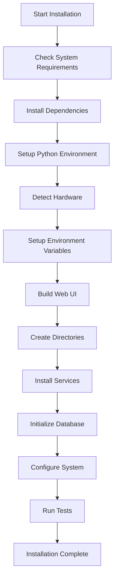
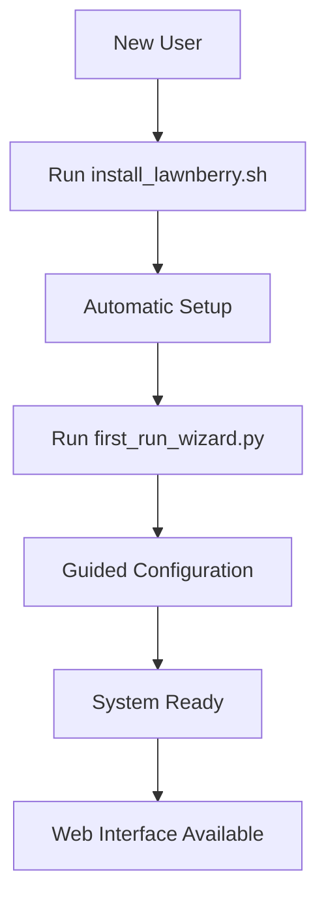

# LawnBerry Pi Installation Scripts

This directory contains comprehensive installation automation scripts for the LawnBerry Pi system. These scripts provide automatic hardware detection, environment setup, and system configuration with minimal user intervention.

## 🚀 Quick Start

For first-time installation on a fresh Raspberry Pi:

```bash
# Clone repository
git clone <repository-url> lawnberry
cd lawnberry

# Run enhanced installer
bash scripts/install_lawnberry.sh

# Optional: Run first-time setup wizard
python3 scripts/first_run_wizard.py
```

## 📋 Script Overview

### Main Installation Scripts

#### `install_lawnberry.sh` ⭐ **PRIMARY INSTALLER**
The main installation script that orchestrates the complete LawnBerry Pi setup process.

**Features:**
- ✅ System requirements checking
- ✅ Automatic dependency installation
- ✅ Hardware detection and configuration
- ✅ Python virtual environment setup
- ✅ Environment variable configuration
- ✅ Database initialization
- ✅ Web UI building
- ✅ System service installation
- ✅ Comprehensive testing

**Usage:**
```bash
# Standard installation
bash scripts/install_lawnberry.sh

# Skip hardware detection
bash scripts/install_lawnberry.sh --skip-hardware

# Skip environment setup
bash scripts/install_lawnberry.sh --skip-env

# Non-interactive mode
bash scripts/install_lawnberry.sh --non-interactive

# Get help
bash scripts/install_lawnberry.sh --help
```

**Requirements:**
- **Raspberry Pi OS Bookworm (REQUIRED)** - 64-bit version
- **Python 3.11+** (included with Bookworm)
- Internet connection for package downloads
- At least 4GB free disk space (8GB+ recommended)
- **4GB+ RAM recommended** (16GB optimal for full features)
- Raspberry Pi 4 Model B (other models may have limited functionality)

### Hardware Detection

#### `hardware_detection.py` 🔍 **HARDWARE SCANNER**
Automatically detects and tests connected hardware components.

**Capabilities:**
- 🔌 I2C device scanning (sensors, displays, power monitors)
- 📡 Serial device detection (GPS, motor controllers, IMU)
- 📷 Camera detection and testing
- 🔧 GPIO capability testing
- 🖥️ System information gathering
- 🧪 Connectivity testing for all detected devices

**Usage:**
```bash
# Run complete hardware detection
python3 scripts/hardware_detection.py

# Integration with other scripts
from hardware_detection import HardwareDetector
detector = HardwareDetector()
results = await detector.detect_all_hardware()
```

**Output Files:**
- `hardware_detection_results.json` - Detailed detection results
- `hardware_detected.yaml` - Generated hardware configuration

### Environment Configuration

#### `setup_environment.py` 🔑 **ENVIRONMENT SETUP**
Interactive and automated environment variable configuration.

**Features:**
- 🔐 Secure API key collection and validation
- 🎲 Automatic secret generation (JWT, passwords)
- ✅ Real-time API key validation
- 📝 `.env` file generation with proper permissions
- 🛡️ Security-focused approach (no sensitive data in config files)

**Usage:**
```bash
# Interactive setup
python3 scripts/setup_environment.py

# Non-interactive setup (uses environment variables)
python3 scripts/setup_environment.py --non-interactive

# Check existing configuration
python3 scripts/setup_environment.py --check
```

**Required API Keys:**
- `OPENWEATHER_API_KEY` - Weather data (required)
- `REACT_APP_GOOGLE_MAPS_API_KEY` - Maps functionality (required)
- `JWT_SECRET_KEY` - Web authentication (auto-generated)
- `LAWNBERRY_FLEET_API_KEY` - Fleet management (optional)

### Database Management

#### `init_database.py` 💾 **DATABASE INITIALIZER**
Sets up SQLite and Redis databases with proper schema and default data.

**Features:**
- 🗄️ SQLite schema creation (15+ tables)
- 🔄 Redis cache initialization
- 📊 Database indexing for performance
- 🔧 Triggers for data management
- 🏥 Health checking capabilities

**Usage:**
```bash
# Initialize databases
python3 scripts/init_database.py

# Check database health
python3 scripts/init_database.py --check-health

# Custom data directory
python3 scripts/init_database.py --data-dir /custom/path
```

**Database Structure:**
- **System Tables:** configuration, health metrics, logs
- **Sensor Tables:** readings, calibration, hardware status
- **Weather Tables:** current data, forecasts, alerts
- **Navigation Tables:** boundaries, patterns, GPS tracking
- **Maintenance Tables:** sessions, records, error logs
- **User Tables:** accounts, preferences, schedules

### User Experience

#### `first_run_wizard.py` 🧙 **SETUP WIZARD**
Interactive first-time setup wizard for new users.

**Guided Setup:**
1. 👋 Welcome and user information collection
2. 🔍 Hardware detection with user-friendly results
3. 🔑 API key configuration with validation
4. 📍 Location and GPS setup
5. 🛡️ Safety settings configuration
6. 🧪 System testing and validation

**Usage:**
```bash
# Run the complete wizard
python3 scripts/first_run_wizard.py
```

**User-Friendly Features:**
- 📖 Plain language explanations
- ✅ Visual status indicators
- 🎯 Experience level adaptation
- 📋 Step-by-step guidance
- 💾 Configuration auto-generation

### System Management

#### `update_lawnberry.sh` 🔄 **SYSTEM UPDATER**
Handles system updates while preserving user configurations.

**Update Process:**
1. 📋 Git status checking
2. 💾 Automatic backup creation
3. ⏹️ Service shutdown
4. 📥 Code update from repository
5. 📦 Dependency updates
6. ⚙️ Configuration migration
7. 🔧 Service file updates
8. 🧪 System testing
9. ▶️ Service restart

**Usage:**
```bash
# Standard update
bash scripts/update_lawnberry.sh

# Force update even if up-to-date
bash scripts/update_lawnberry.sh --force

# Non-interactive update
bash scripts/update_lawnberry.sh --non-interactive

# Include hardware detection
bash scripts/update_lawnberry.sh --hardware-detection

# Skip backup (not recommended)
bash scripts/update_lawnberry.sh --skip-backup
```

#### `uninstall_lawnberry.sh` 🗑️ **SYSTEM UNINSTALLER**
Safely removes LawnBerry Pi while preserving user data.

**Removal Process:**
- ⏹️ Service shutdown and removal
- 🧹 System script cleanup
- 📝 Log rotation removal
- 🐍 Virtual environment removal
- 💾 Optional data preservation
- 📦 Cache cleanup

**Usage:**
```bash
# Interactive uninstall (recommended)
bash scripts/uninstall_lawnberry.sh

# Force uninstall without prompts
bash scripts/uninstall_lawnberry.sh --force

# Complete removal including data
bash scripts/uninstall_lawnberry.sh --complete
```

## 🛠️ Installation Workflow

### Standard Installation Flow



### First-Time User Experience



## 📁 File Structure After Installation

```
/opt/lawnberry/                 # Installation directory (if used)
/var/lib/lawnberry/            # Data directory
├── database/                   # SQLite databases
├── config_backups/            # Configuration backups
└── health_metrics/            # System health data

/var/log/lawnberry/            # Log directory
├── system.log                 # System logs
├── hardware.log               # Hardware logs
└── error.log                  # Error logs

/etc/systemd/system/           # Service files
├── lawnberry-system.service   # Main system service
├── lawnberry-hardware.service # Hardware service
└── ...                        # Additional services

Project Directory:
├── .env                       # Environment variables
├── venv/                      # Python virtual environment
├── hardware_detection_results.json
├── first_run_wizard.json      # Wizard completion data
└── config/                    # Updated configurations
```

## 🔧 System Control Commands

After installation, these commands are available system-wide:

```bash
# System control
lawnberry-system start         # Start all services
lawnberry-system stop          # Stop all services
lawnberry-system restart       # Restart system
lawnberry-system status        # Show system status
lawnberry-system logs [service] # View logs
lawnberry-system hardware      # Run hardware detection

# Health monitoring
lawnberry-health-check         # Quick health check
```

## 🐛 Troubleshooting

### Common Issues

#### Permission Errors
```bash
# Fix script permissions
chmod +x scripts/*.sh scripts/*.py

# Fix data directory permissions
sudo chown -R $USER:$USER /var/lib/lawnberry
```

#### Hardware Detection Issues
```bash
# Enable I2C and SPI manually
sudo raspi-config
# Navigate to Interface Options > I2C/SPI > Enable

# Check hardware connections
lawnberry-system hardware
```

#### Environment Variable Issues
```bash
# Re-run environment setup
python3 scripts/setup_environment.py

# Check environment file
cat .env
```

#### Service Issues
```bash
# Check service status
systemctl status lawnberry-system.service

# View service logs
journalctl -u lawnberry-system.service -f

# Reload services
sudo systemctl daemon-reload
```

### Log Locations

- **Installation logs:** `/tmp/lawnberry_install.log`
- **System logs:** `/var/log/lawnberry/`
- **Service logs:** `journalctl -u lawnberry-*`
- **Hardware detection:** `hardware_detection_results.json`

### Recovery Procedures

#### Restore from Backup
```bash
# List available backups
ls /var/backups/lawnberry/

# Restore configuration
cp /var/backups/lawnberry/backup_*/config/* config/
```

#### Reset to Defaults
```bash
# Uninstall and reinstall
bash scripts/uninstall_lawnberry.sh
bash scripts/install_lawnberry.sh
```

## 📚 Additional Resources

- **Installation Guide:** `docs/installation-guide.md`
- **User Manual:** `docs/user-manual.md`
- **Troubleshooting Guide:** `docs/troubleshooting-guide.md`
- **Hardware Overview:** `docs/hardware-overview.md`

## 🤝 Contributing

When adding new installation features:

1. **Follow the pattern:** Use consistent logging, error handling, and user feedback
2. **Test thoroughly:** Test on clean Raspberry Pi OS installations
3. **Document:** Update this README and relevant documentation
4. **Backward compatibility:** Ensure existing installations can update smoothly

## 📄 License

These installation scripts are part of the LawnBerry Pi project and follow the same licensing terms as the main project.

---

**Need Help?** 
- Check the troubleshooting section above
- Review the installation logs
- Run `lawnberry-health-check` for system status
- Consult the full documentation in the `docs/` directory
